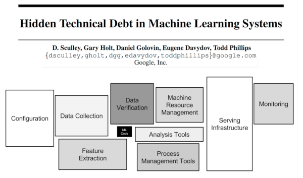

# moma - Model Management Tool for DataOps

An effort to create an open source combination of the ideas from [rorodata's SaaS](http://www.rorodata.com/) as presented at Strata Data Conference 2017 in Singapore in their talk [Managing machine learning models in production](https://conferences.oreilly.com/strata/strata-sg/public/schedule/detail/62965), and Accenture's [Model Management Framework](https://www.accenture.com/us-en/insight-improved-automated-analytics) as presented in their talk at the same Strata Data Conference 2017 in Singapore called [DevOps for models](https://conferences.oreilly.com/strata/strata-sg/public/schedule/detail/62831).

The tooling required for production-ready and scalable ML products and the debt it creates is often a bigger part than the actual ML product, and the tooling, expertise, best practices and frameworks for doing it is not as well known or developed.

<a href="docs/images/hidden-tech-debt-ml.png"></a>

Quote from [VentureBeat](https://venturebeat.com/2017/11/28/infrastructure-3-0-building-blocks-for-the-ai-revolution/?imm_mid=0f8fc7&cmp=em-data-na-na-newsltr_ai_20171204):

> Collectively, the innovations of this epoch — Infrastructure 3.0 — will be about unlocking the potential of ML/AI and providing the building blocks for intelligent systems. As with previous generations, there will be new projects, platforms, and companies that emerge and challenge the current incumbency. The arms dealers for this imminent ML/AI revolution promise to be the infrastructure giants of tomorrow.

<a href="docs/images/ml-stack.png"></a>

From the above image we can see that the ML stack is quite complex, but a lot of the moving parts are repeative boilerplate work that is dying to be automated, so data scientists and machine learning engineers can focus on what's important.

Overview of planned features:

* model revisions (git?),
* automated deployments (ansible?),
* continuous retraining (cron?),
* per-model evaluation metric for alerts,
* auto-generate REST API,
* automatic jupyter notebook inclusion in pipeline for debugging.

Example from rorodata:

```
$  roro models:list 
credit-risk v4 
hello-world v3 

$  roro models:log 
Model-ID: 4fbe8871 
Model-Name: credit-risk 
Model-Version: 4 
Date: Thu Sep 1 13:16 2017 +530 
  Updated model with August data 

Model-ID: bdc0a3b4 
Model-Name: hello-world 
Model-Version: 3 
Date: Thu Jul 27 11:17 2017 +530 
  First version of hello-world 

$  roro models:show credit-risk:4
Model-ID: 4fbe8871
Model-Name: credit-risk
Model-Version: 4
Date: 2017-09-27 15:46:31
Content-Encoding: joblib
Algo: DecisionTree
Accuracy: 0.85
Parameters: max_depth=4;random_state=12345;criterion=gini
```

Quote from Accenture:

> Failure is assumed, and exception handling and resiliency is central to the design. When a data scientist submits the model for deployment, she also specifies a quality condition and the associated behavior when that condition is broken. Automatic retraining can happen as a result of breaking that condition or through regularly scheduled intervals. Accenture refers to this capability as self-healing.

Quote from rorodata:

> So how do you manage multiple versions of a model; version control the datasets used for model building; tag production and staging versions of a model; switch from one version to another seamlessly without any service disruption; or monitor performance of a live model?
